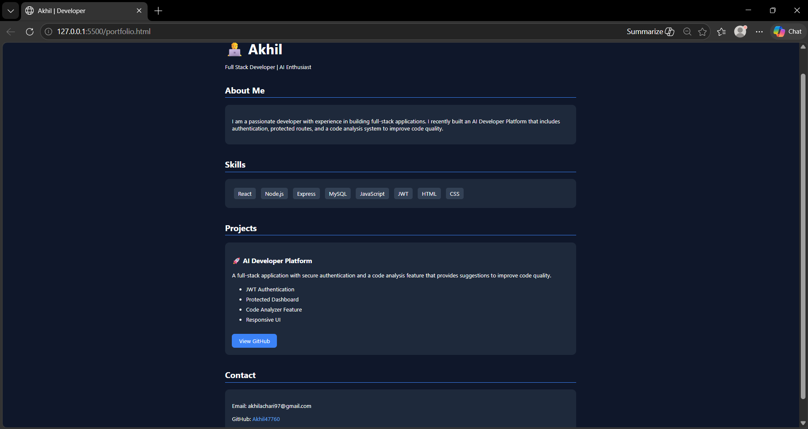

# AI Developer Platform

A full-stack web application where users can register, log in securely, access a protected dashboard, and analyze code using an AI-like code review system.

## Features
- User Registration and Login
- JWT Authentication
- Protected Dashboard
- Logout Functionality
- Code Review / Code Analysis Feature
- Modern React UI

## Tech Stack
- Frontend: React
- Backend: Node.js, Express
- Database: MySQL
- Authentication: JWT, bcrypt

## Project Structure
- `frontend/` - React application
- `backend/` - Node.js backend and APIs

## How to Run

### Backend
```bash
cd backend
npm install
node server.js

## Screenshots



